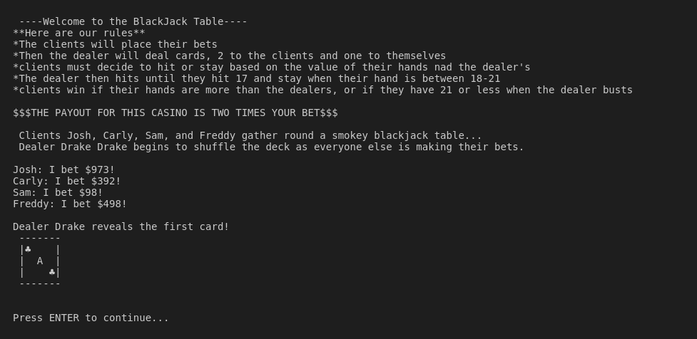
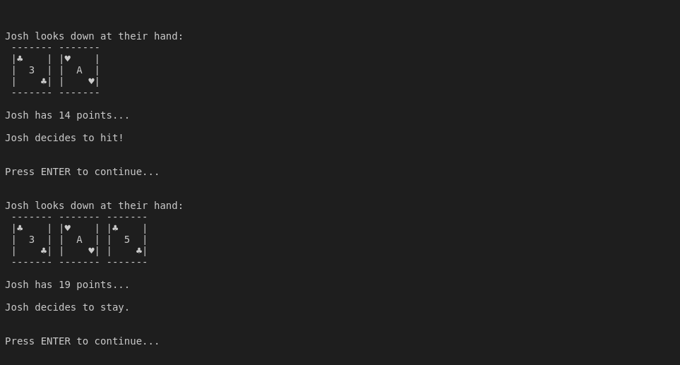
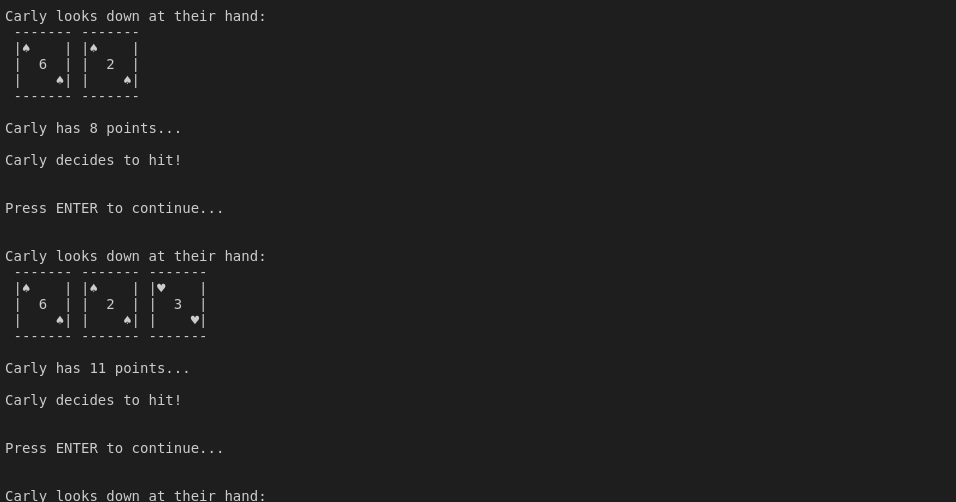
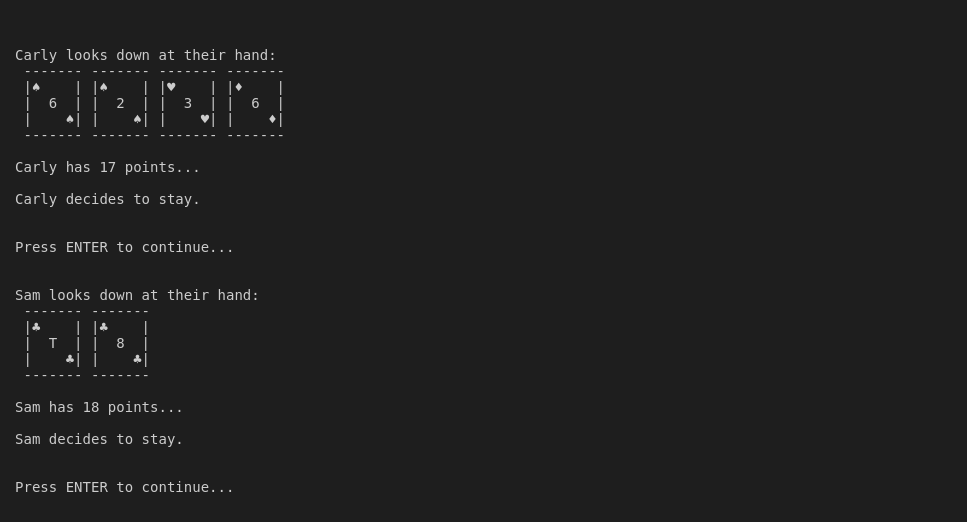
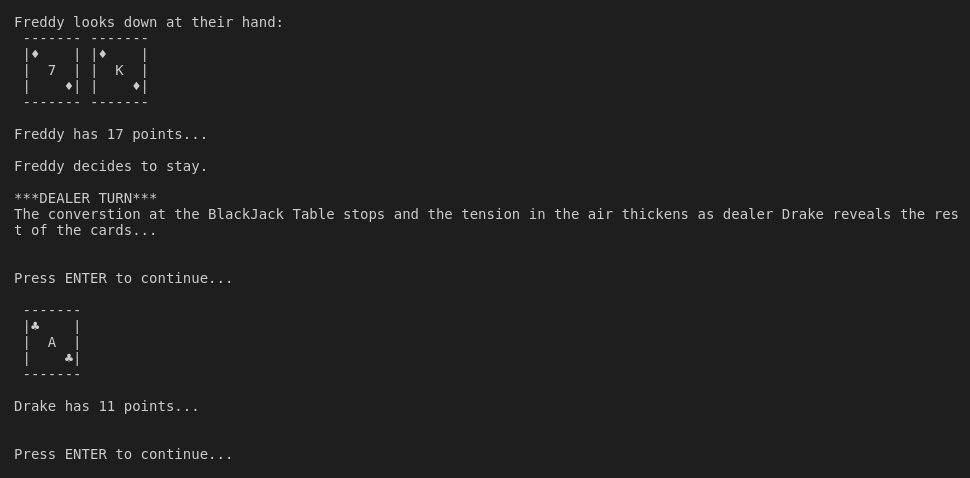
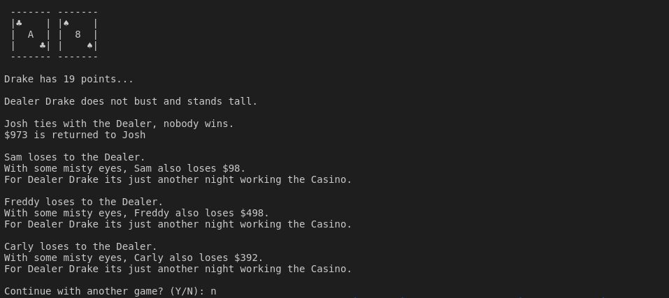

# COMP262-CompArchitectureProject

### My final project for **CSU Channel Islands** COMP 262 Computer Architecture involving multi-threading in OpenMP and a basic Utility AI implementation that can play blackjack with the dealer. Developed using Ubuntu and compiling on the command line with gcc.

## Multi-Threading with OpenMP

This project was based around the c library of OpenMP and how we could create a basic blackjack implementation using different threads as the players and one thread for the dealer.

The Comp262FinalProject.c file drives the game and gets the job done, but is a huge mess of a file that really could use some abstraction in order to much more readable. There was also probably better ways to organize the overall structure of the blackjack implementation in order to create a more robust solution.

```
// Parallelizes for loop, giving each thread 1 loop to run
// Splits each client into 5 threads, one for each client and the dealer.
//Dealer is thread 0, while clients are threads 1-3

 #pragma omp parallel for ordered schedule(static,1)
        for (int i = 0; i < 5; i++)         
```  

This is the main loop, we run calculations in parallel with them joining and splitting again over different key periods over the course of a round. Programing a multi-threaded application in C was a really great experience and has made me a lot more comfortable with trying to write code that can easily be executed in parallel. Though the part I am really proud of in this project was creating the player AI.  


## Basic Utility AI

The AI has different values assigned to different events in the game world. These values from the events (in this case to Hit or Stay on the current dealer card) will be added into one value that is supposed to represent the AI's next action.  

*inside blackJackBehavior.c*

To know whether or not to add to the Hit or Stay values I used a transition table in order for the AI to have a basic idea on which cards were viable for them to have a chance at winning against the dealer. 

```C
// Part of the decision making process, 'h' is for hit, 's' is for stay
char scoreTable[10][10] = {{'h','h','s','s','s','h','h','h','h','h'}, 
{'s','s','s','s','s','h','h','h','h','h'},
{'s','s','s','s','s','h','h','h','h','h'},
{'s','s','s','s','s','h','h','h','h','h'},
{'s','s','s','s','s','h','h','h','h','h'},
{'s','s','s','s','s','s','s','s','s','s'},
{'s','s','s','s','s','s','s','s','s','s'},
{'s','s','s','s','s','s','s','s','s','s'},
{'s','s','s','s','s','s','s','s','s','s'},
{'s','s','s','s','s','s','s','s','s','s'}};
```

It is a 10x10 table since there are 10 cards to choose from either the player or dealer's hand.

From here a value will be added to the overall next action with some other action values being added to give the player's some small emergent behaviors. Things like if they have been winning or losing previous rounds will be added into their next action value which will inform their overall choice to hit or stay. 

Once this system is set up it is pretty flexible to add new values to help decide what the AI's next action will be, as all input data can be represented as a value to add and the next action can be decided by looking at the range of what the final action value added up to.

The idea of the Utility AI was based off of this article https://www.gamasutra.com/blogs/JakobRasmussen/20160427/271188/Are_Behavior_Trees_a_Thing_of_the_Past.php where you can find out more. I still think behavior trees are great and fun, but I like to experiment with different possibilities. I'm interested in hooking up this kind of AI pattern with machine learning/pattern recognition.

-DW

## Example Run













